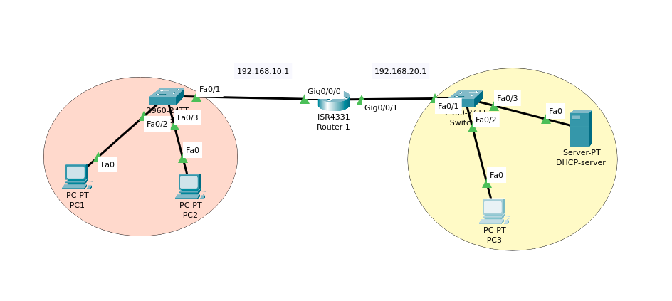
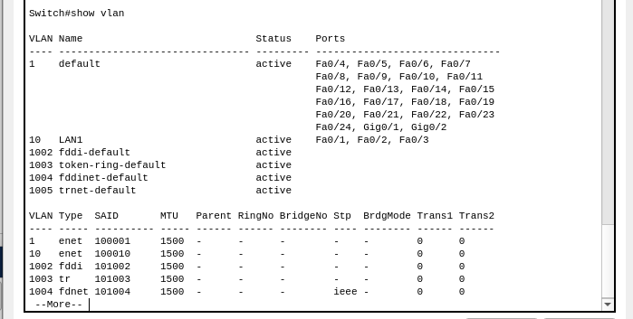
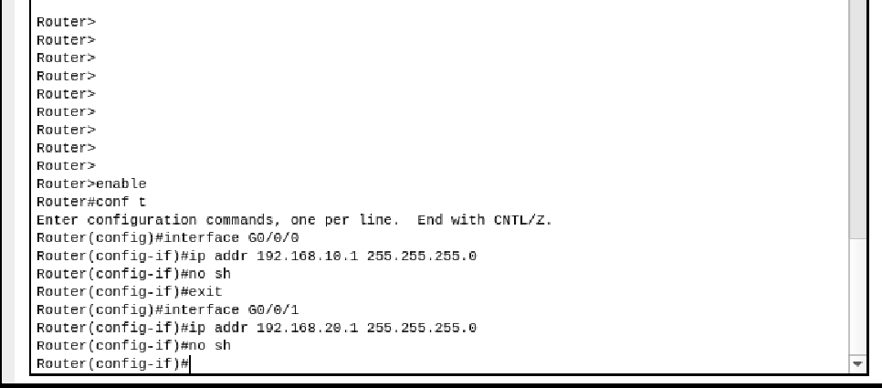
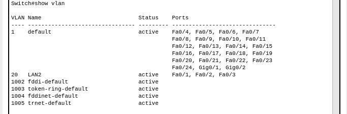
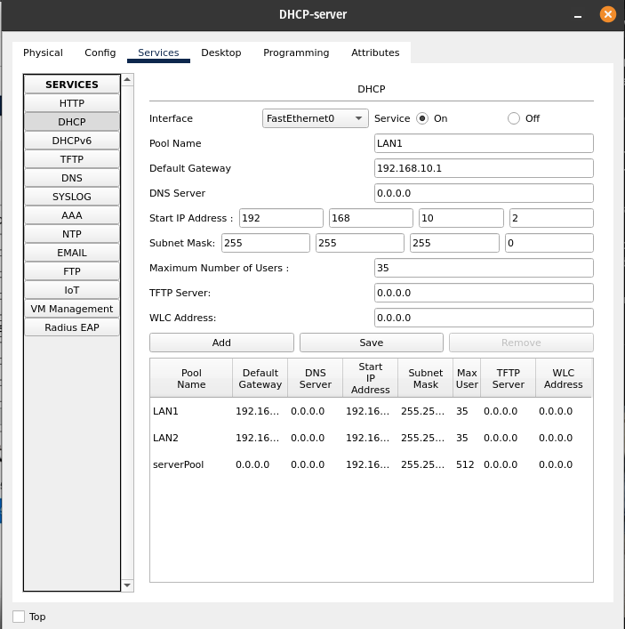
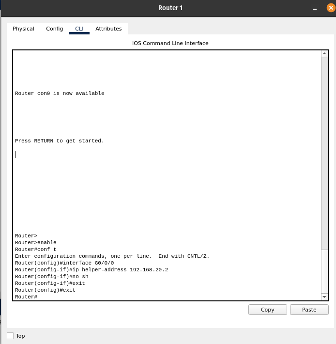
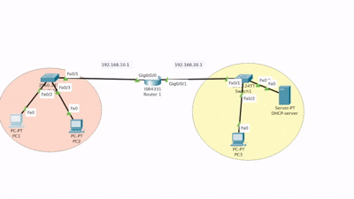
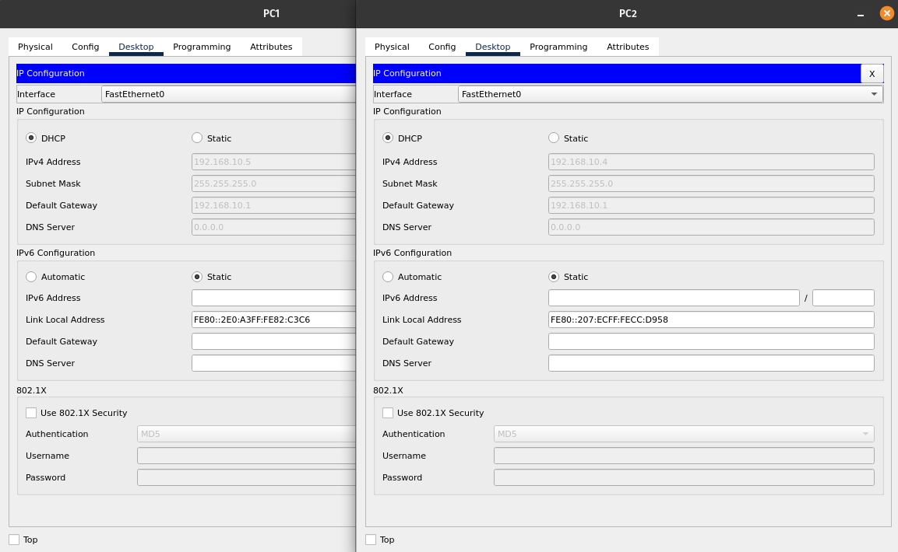

# Simple DHCP-relay Cofiguration - Cisco Packet tracer

## Project Description

This project demonstrates the configuration of **DHCP Relay** across multiple VLANs using a central router also -known as "router-on-a-stick"- and a shared DHCP server. 
DHCP Relay allows devices in different subnets (VLANs) to obtain IP addresses from **a single DHCP server**, even if they’re not in the same broadcast domain.

## Note
Using DHCP relay is convenient because it **eliminates the need** to deploy a separate DHCP server in each broadcast domain or VLAN.
However, it introduces a **single point of failure** — if the centralized DHCP server goes offline, no clients can obtain IP addresses. [APIPA => 169.254.x.x/16]
While this setup is easier to **manage** and **troubleshoot** (you know exactly where the issue is), **it lacks redundancy** unless backed by a secondary DHCP server or failover configuration.

## Topology


## 🧰 V-Components Used

- **Router**: ISR4331 (Router1)
- **Switch**: 2960-24TT (Switch0, Switch1)  
- **DHCP Server**: Server-PT ("DHCP-server")
- **End Devices**: PCs (PC-PT)
- **VLANs**:
  - VLAN 10 – 192.168.10.0/24
  - VLAN 20 – 192.168.20.0/24

## Network Configuration:





Instruction:

### Note
Okay... sure, you can do it using the GUI.
But let’s be honest — when it comes to working with network appliances, the CLI is where the "real power" is.
It gives you way more flexibility for configuration and experimentation.

## 1.Setting router up

First, we need to assign an IP address to a physical interface.
Why a physical interface instead of a subinterface (e.g., G0/0/0.10)?

Well, here's the thing — when your switch has only one VLAN (by default: VLAN1, the first VLAN), and it’s connected point-to-point to the router, you don’t need subinterfaces.
Just assign the IP directly to the physical port.

## ⚠️ Disclaimer:
For security reasons, never use VLAN1 in real-world scenarios. Always create a different VLAN ID.
(Remember: VLANs 1002–1005 are reserved for Token Ring and FDDI.)
VLAN1 is like using the default username and password — it’s predictable, and attackers can exploit it using techniques like VLAN hopping.

**For example:**
You have only one VLAN on your switch. No tagging, no additional VLANs — just a flat setup.
No need to overcomplicate it with dot1q or subinterfaces.

Router: 
``` 
Router> enable   (EXEC privilaged mode)
Router# configure terminal   (shortcut: "configure terminal)
Router(config)# interface GigabitEthernet0/0/0   (shortcut: int G0/0/0)
Router(config-if)# ip address 192.168.10.1 255.255.255.0   (here we define ip address on G0/0/0 and netmask)
Router(config-if)# no sh   (no shutdown - "don't close that port interface cisco-chan" )
```
Now, repeat this on the second interface (G0/0/1) for the other switch, using a different IP (e.g., 192.168.20.1).
Here we go!

### Note:
After this step, the links between your switches and the router should turn green on both sides — that's great! That means the connection is up and working.

## DHCP server configuration:

Welp... now it’s time to configure the DHCP server.
Unfortunately, in Cisco Packet Tracer, we only have GUI options — there's no CLI (kek).
Of course, creating a DHCP scope/reservation/exclusion etc. on a real Windows Server is a bit different than in Packet Tracer, but the core concept is the same - In the near future, I’ll make a tutorial for this using real-world tools — stay tuned!


First we have to assign ip address for DHCP-server. 
The server is located in the 192.168.20.0/24 subnet — also part of VLAN20. (switch1)

Go to:
**[Desktop]**->**[ip Configuration]**
- Set ip as **Static** 
- Netmask: 255.255.255.0 (/24)
- Gateway: 192.168.20.1 (set to the router IP for VLAN20)
- DNS: not needed, BUT Packet Tracer forces you to fill it — so just use ```0.0.0.0```

#### That's all for that configuration!

## Set Scopes.....Scoopy-Scoops 
Next step — define a DHCP Scope (aka address pool) for each subnet that should get IPs dynamically.. Yep, each subnet that wants to use the DHCP server needs its own scope.
Go to:
**[Services]**->**[DHCP]**
My setup is:
- LAN1 [192.168.10.0/24]
- LAN2 [192.168.20.0/24])
But of course — name them however you like..


## Explanations:
- **Services** set to "On" (that means that the service DHCP is in use/up)
- **Pool Name**: LAN1 - but you can name it whatever you want.
- **DNS server**: 0.0.0.0 - because we don't and we nor use it for now
- **Start IP Address** 192.168.10.2
- **Subnet Mask**: 255.255.255.0 - it's Class C
- ** Max. Number of Users**: 35 - You can set it up as you want
Leave other as it is

And Next click **Add***
Repeat that process for each subnet you have/want to set up to scope, and also click "**Add**".
After that click **"Save"**
DONE! - now we need to only specife to what subnet should router request for obtain IP for devices on differents subnet.
For that we will use "```ip helper-address <DHCP_ip_address>```"

## Explanation: 
### why need exactly specifed "ip helper-address" - or even type it in?
Welp... because routers do not forward broadcast packets — and that’s actually a good thing.
If they did, your whole network would melt down in a broadcast storm, flooded with packets and frames, clogging everything up like your sist
ok nvm, bad joke kek.

But here’s the cool part: we can use this behavior to our advantage.
We can tell the router:
>"Hey, when a device sends a **broadcast DHCP Discover**, just forward it to that specific **DHCP server**."

I could boring you about layers and other stuff but c'cmon. The **Most Important** facts - if you want to look at **OSI Model** or **Inbound**/**Outbound** pages-to know, are:
---------------------------------------
**1. Device sends a broadcast frame**
-  MAC destination: FF:FF:FF:FF:FF:FF (means “send to everyone” - broadcast)
-  IP destination: 255.255.255.255 (also broadcast)
**2. Frame hits the switch:**
-  Switch says: “Oh it's a broadcast? Sure, I’ll flood it to all ports in that VLAN.”
**3. Frame hits the router** - if we’ve enabled ip helper-address on that router interface…
-  The router steps in and transforms the broadcast into a unicast packet.
-  Now the MAC destination is the DHCP server’s MAC.
-  And IP destination is the server’s IP (from the helper-address).
-  The router keeps the original client’s MAC/IP info inside the packet (so the server knows who’s asking).
**4. Server replies back (Offer)**
-  This is a unicast sent back to the router
-  Router knows where the client is and re-converts it (if needed) into a broadcast (if client doesn’t have an IP yet).
**5. Client gets the Offer and continues the DORA process.**
----------------------------------------
Yeah...Anyway. Let's back to our trace..



## Setting ip helper-address:
Another step to do that is type that on interface(subnet) that doesn't have DHCP server at it's own and provide DHCP server IP (logical interface IP).

```
Router> enable
Router# configure terminal
Router(config)# interface G0/0/0
Router(config-if)# ip helper-address 192.168.20.1
Router(config-if)# no shutdown
```
DONE!

## Check if it's working:
1. On end device:
```Desktop``` -> ```IP Configuration``` -> Set to **DHCP**
2. Open **Simulation Mode**
(bottom right in Packet Tracer UI)
3. Click "**Show All/None**" -> then filter for **DHCP**
4. Hit play, and observe DORA!



## Configuration on PCs/end-devices after:

All working FINE. Congrats! :+1:

# :collision: Troubleshooting:
## Packet dropped at router?
### solution:
Check if you configured ip helper-address correctly.
Verify IP (192.168.20.1 in this case). 
**Note:**```sh run interface vlan <VLAN ID>``` (on EXEC mode).

## GOT APIPA address (169.254.x.x)?
### Solution:
- Make sure **DHCP is ON** on the server
- Check DHCP Pool:
Did you forget to define a scope for that subnet?
